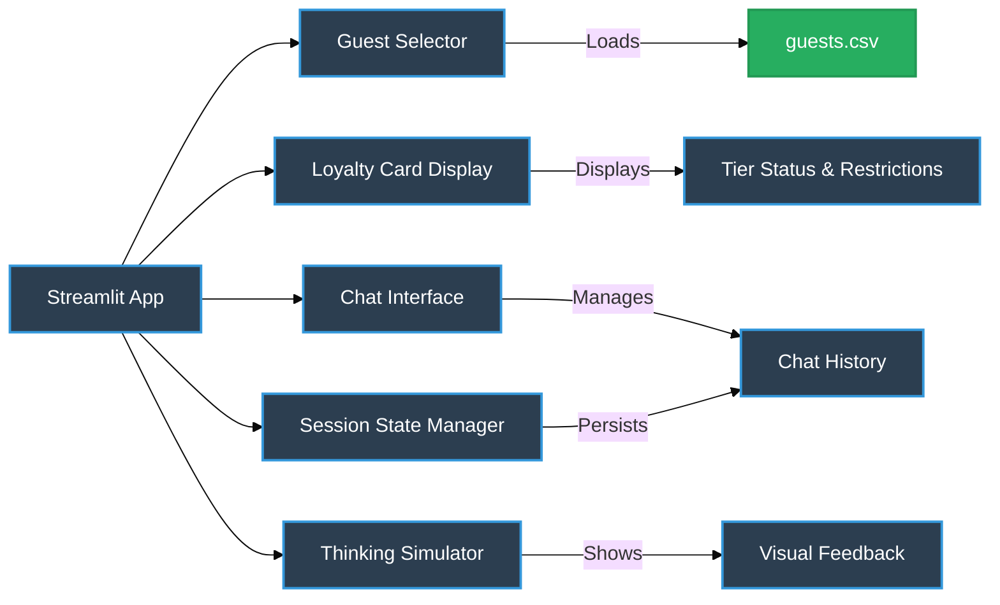
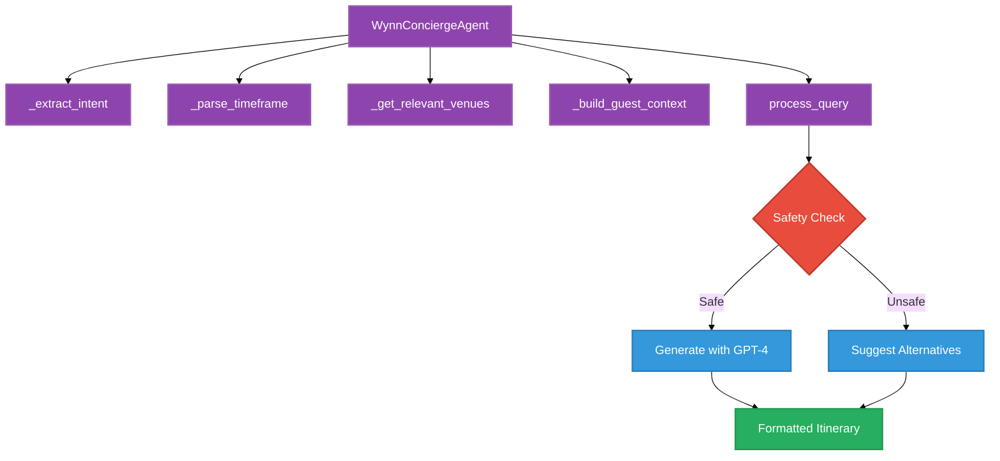
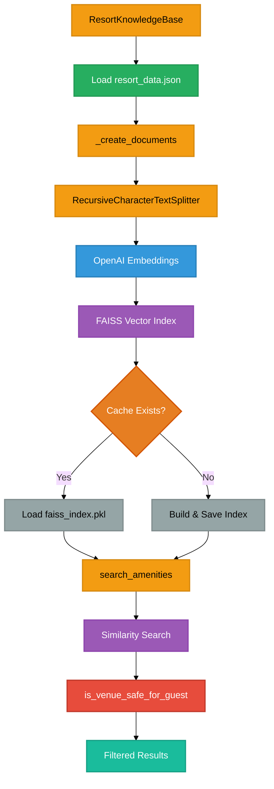
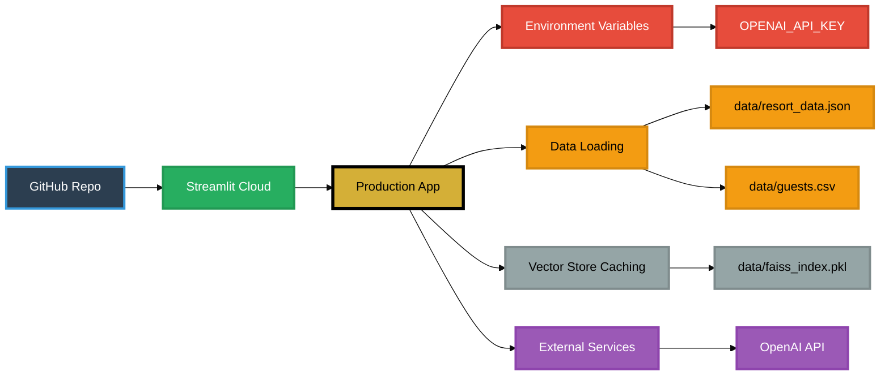

# 🏝️ Wynn Concierge AI - System Architecture Flow

> **Professional Architecture Diagram** - Grounded in actual codebase implementation

## 🎯 System Overview

This diagram illustrates the complete data flow and component interactions in the Wynn Concierge AI system, from guest interaction through AI-powered recommendation generation.

---

## 📊 Complete System Architecture

```mermaid
%%{init: {'theme':'base', 'themeVariables': {'fontSize':'18px', 'fontFamily':'arial'}, 'flowchart':{'nodeSpacing': 50, 'rankSpacing': 60}}}%%
graph TB
    %% Styling
    classDef userClass fill:#d4af37,stroke:#000,stroke-width:4px,color:#000,font-size:18px
    classDef frontendClass fill:#2c3e50,stroke:#3498db,stroke-width:3px,color:#fff,font-size:16px
    classDef agentClass fill:#8e44ad,stroke:#9b59b6,stroke-width:3px,color:#fff,font-size:16px
    classDef aiClass fill:#e74c3c,stroke:#c0392b,stroke-width:3px,color:#fff,font-size:16px
    classDef dataClass fill:#27ae60,stroke:#229954,stroke-width:3px,color:#fff,font-size:16px
    classDef vectorClass fill:#f39c12,stroke:#d68910,stroke-width:3px,color:#000,font-size:16px
    
    %% User Layer
    Guest[👤 Guest/User<br/>Web Browser]:::userClass
    
    %% Frontend Layer - Streamlit
    subgraph Frontend["🖥️ STREAMLIT FRONTEND (app.py)"]
        UI[Guest Selector<br/>Loyalty Card Display<br/>Chat Interface]:::frontendClass
        Session[Session State Manager<br/>Chat History]:::frontendClass
        Thinking[Thinking Process Simulator<br/>Visual Feedback]:::frontendClass
    end
    
    %% Agent Orchestration Layer
    subgraph Agent["🤖 AGENT ORCHESTRATOR (agent_logic.py)"]
        WCA[WynnConciergeAgent<br/>Chief Concierge Persona]:::agentClass
        Intent[Intent Extraction<br/>Query Parser]:::agentClass
        Context[Guest Context Formation<br/>Profile + Restrictions + Tier]:::agentClass
        Safety[Safety Validation<br/>Dietary Cross-Reference]:::agentClass
        Reasoning[Multi-Step Reasoning<br/>Search → Filter → Rank → Generate]:::agentClass
    end
    
    %% AI Layer
    subgraph AI["🧠 AI SERVICES"]
        GPT4[OpenAI GPT-4<br/>ChatOpenAI<br/>Temperature: 0.7<br/>Max Tokens: 1500]:::aiClass
        Embeddings[OpenAI Embeddings<br/>text-embedding-3-small]:::aiClass
    end
    
    %% Knowledge Layer
    subgraph Knowledge["📚 KNOWLEDGE BASE (vector_store.py)"]
        KB[ResortKnowledgeBase<br/>RAG Engine]:::vectorClass
        FAISS[FAISS Vector Store<br/>25 Venue Embeddings<br/>Cached to .pkl]:::vectorClass
        Filter[Guest-Aware Filtering<br/>Allergy Detection<br/>Dietary Restrictions<br/>Halal Verification]:::vectorClass
        Search[Semantic Similarity Search<br/>RecursiveCharacterSplitter]:::vectorClass
    end
    
    %% Data Layer
    subgraph Data["💾 DATA LAYER"]
        ResortData[(resort_data.json<br/>25 Luxury Venues<br/>Rich Metadata)]:::dataClass
        GuestData[(guests.csv<br/>5 Guest Profiles<br/>Preferences & Restrictions)]:::dataClass
        Generator[data_generator.py<br/>Synthetic Data Creation]:::dataClass
    end
    
    %% Main Flow
    Guest -->|HTTPS Request| UI
    UI -->|Guest Selection| GuestData
    GuestData -->|Load Profile| UI
    UI -->|User Query + Profile| WCA
    
    WCA -->|1. Parse Query| Intent
    Intent -->|2. Extract Keywords & Vibes| Context
    Context -->|3. Combine with Guest Data| Safety
    
    Safety -->|4. Semantic Search Query| KB
    KB -->|Request Embeddings| Embeddings
    Embeddings -->|Vector Embeddings| FAISS
    
    FAISS -->|Load Venue Data| ResortData
    ResortData -->|25 Venues with Metadata| FAISS
    FAISS -->|Similarity Search Results| Search
    Search -->|Relevant Venues| Filter
    
    Filter -->|5. Apply Safety Rules| Safety
    Safety -->|Safe Venue List| Reasoning
    
    Reasoning -->|6. Construct Prompt<br/>System + Venues + Context| GPT4
    GPT4 -->|7. Generated Itinerary<br/>Personalized Response| WCA
    
    WCA -->|8. Format Response| Session
    Session -->|Update Chat History| UI
    UI -->|Display with Thinking Animation| Thinking
    Thinking -->|Render Response| Guest
    
    %% Data Generation
    Generator -.->|Generates| ResortData
    Generator -.->|Generates| GuestData
    
    %% Feedback Loop
    Guest -->|Next Query| UI
```



---

## 🔄 Detailed Data Flow Sequence

```mermaid
%%{init: {'theme':'base', 'themeVariables': {'fontSize':'16px', 'fontFamily':'arial'}, 'sequence':{'messageMargin': 60, 'actorFontSize': 16, 'messageFontSize': 15, 'noteFontSize': 14}}}%%
sequenceDiagram
    autonumber
    participant User as 👤 Guest
    participant UI as 🖥️ Streamlit UI
    participant Agent as 🤖 WynnConciergeAgent
    participant Vector as 📚 Vector Store
    participant OpenAI as 🧠 OpenAI API
    participant Data as 💾 Data Store
    
    %% Initialization
    rect rgb(40, 50, 60)
        Note over UI,Data: System Initialization
        UI->>Data: Load guests.csv
        Data-->>UI: 5 Guest Profiles
        UI->>Vector: Initialize ResortKnowledgeBase
        Vector->>Data: Load resort_data.json
        Data-->>Vector: 25 Venue Definitions
        Vector->>OpenAI: Request Embeddings (text-embedding-3-small)
        OpenAI-->>Vector: Vector Embeddings
        Vector->>Vector: Build/Load FAISS Index (.pkl cache)
        Vector-->>UI: ✅ Knowledge Base Ready
    end
    
    %% Guest Selection
    rect rgb(46, 125, 50)
        Note over User,UI: Guest Selection Phase
        User->>UI: Select Guest (e.g., Sarah Chen)
        UI->>UI: Display Loyalty Card (Black Tier)
        UI->>UI: Show Dietary Restrictions (Vegetarian)
    end
    
    %% Query Processing
    rect rgb(142, 68, 173)
        Note over User,Agent: Query Processing Phase
        User->>UI: "I want a steak dinner and a wild night out"
        UI->>Agent: process_query(query, guest_profile)
        Agent->>Agent: _extract_intent(query)<br/>→ categories: [Fine Dining, Nightlife]<br/>→ vibes: [energetic]
        Agent->>Agent: _parse_timeframe(query)<br/>→ 18:00 - 02:00
    end
    
    %% RAG Retrieval
    rect rgb(243, 156, 18)
        Note over Agent,Vector: RAG Retrieval Phase
        Agent->>Vector: search_amenities(query, guest_profile, category)
        Vector->>Vector: Semantic similarity search in FAISS
        Vector-->>Agent: Top-k venues (pre-filtered)
        Agent->>Agent: _get_relevant_venues()<br/>Merge results from multiple categories
    end
    
    %% Safety Validation
    rect rgb(231, 76, 60)
        Note over Agent,Vector: Safety Validation Phase
        Agent->>Vector: is_venue_safe_for_guest(venue, guest_profile)
        Vector->>Vector: Check allergen_warnings<br/>Cross-reference dietary_restrictions
        Vector-->>Agent: Safety verdict (True/False)
        Agent->>Agent: Filter unsafe venues<br/>(e.g., steakhouse → excluded)
    end
    
    %% LLM Generation
    rect rgb(192, 57, 43)
        Note over Agent,OpenAI: LLM Generation Phase
        Agent->>Agent: Construct SYSTEM_PROMPT<br/>+ Guest Context + Safe Venues
        Agent->>OpenAI: ChatOpenAI.invoke()<br/>Model: gpt-4<br/>Temperature: 0.7
        OpenAI->>OpenAI: Multi-step reasoning:<br/>1. Parse constraints<br/>2. Build timeline<br/>3. Select venues<br/>4. Generate narrative
        OpenAI-->>Agent: Personalized itinerary text
    end
    
    %% Response Rendering
    rect rgb(52, 73, 94)
        Note over User,UI: Response Rendering Phase
        Agent-->>UI: Complete response with reasoning
        UI->>UI: Simulate thinking process<br/>(Checking availability, Verifying constraints)
        UI->>UI: Stream response to chat
        UI-->>User: Display formatted itinerary<br/>with VIP perks & safety notes
    end
    
    %% Feedback Loop
    rect rgb(100, 100, 100)
        Note over User,UI: Conversation Continues
        User->>UI: Follow-up question<br/>(e.g., "What about dessert?")
        UI->>Agent: process_query (with chat history)
    end
```



---

## 🧩 Component Breakdown

### 1️⃣ **Frontend Layer** (`app.py`)


**Key Functions:**
- `main()`: Application entry point
- `load_guests()`: CSV parsing for guest profiles
- `display_loyalty_card()`: VIP card rendering (Black/Platinum tier)
- `simulate_thinking()`: Progressive text animation for UX
- Session state management via `st.session_state`

---

### 2️⃣ **Agent Orchestrator** (`agent_logic.py`)


**Key Features:**
- **SYSTEM_PROMPT**: 400+ word persona definition with safety rules
- **Intent Extraction**: Regex-based category/vibe detection
- **Multi-step Reasoning**: Search → Filter → Rank → Generate
- **LLM Integration**: `ChatOpenAI` with conversation templates

---

### 3️⃣ **Knowledge Base** (`vector_store.py`)


**Core Capabilities:**
- **RAG Pipeline**: `resort_data.json` → Documents → Embeddings → FAISS
- **Safety Engine**: Cross-references `allergen_warnings` with `dietary_restrictions`
- **Caching**: `.pkl` serialization for fast loading (avoids re-embedding)
- **Metadata Preservation**: Full venue data attached to embeddings

---

## 🎭 Key Workflows

### Workflow 1: Safety-Critical Scenario

```mermaid
%%{init: {'theme':'base', 'themeVariables': {'fontSize':'16px', 'fontFamily':'arial'}, 'flowchart':{'nodeSpacing': 50, 'rankSpacing': 50}}}%%
flowchart TD
    Start([👤 Vegetarian Guest]) --> Query[🗣️ Request: Steak Dinner]
    Query --> Agent{🤖 Agent Analysis}
    
    Agent --> Extract[📋 Extract Intent<br/>Category: Fine Dining<br/>Keywords: steak, dinner]
    Extract --> RAG[🔍 RAG Search<br/>Returns: Steakhouses + Alternatives]
    
    RAG --> Safety{🛡️ Safety Filter}
    Safety -->|Steakhouse| Unsafe[❌ Contains: beef<br/>Guest Restriction: Vegetarian<br/>→ is_safe = False]
    Safety -->|Vegetarian Fine Dining| Safe[✅ Dietary Match<br/>→ is_safe = True]
    
    Unsafe --> Alternative[🔄 Graceful Redirect]
    Safe --> Alternative
    
    Alternative --> GPT[🧠 GPT-4 Generation<br/>SYSTEM_PROMPT:<br/>While steakhouse is exceptional,<br/>given your dietary preferences...]
    
    GPT --> Response[📋 Itinerary:<br/>Azure Garden @ 7:00 PM<br/>VIP Table Secured<br/>+ nightlife venues]
    Response --> End([✨ Guest Satisfied & Safe])
    
    style Start fill:#27ae60,stroke:#229954,stroke-width:3px,color:#fff
    style Unsafe fill:#e74c3c,stroke:#c0392b,stroke-width:2px,color:#fff
    style Safe fill:#27ae60,stroke:#229954,stroke-width:2px,color:#fff
    style End fill:#d4af37,stroke:#000,stroke-width:3px,color:#000
```


### Workflow 2: VIP Recognition

```mermaid
%%{init: {'theme':'base', 'themeVariables': {'fontSize':'16px', 'fontFamily':'arial'}, 'flowchart':{'nodeSpacing': 50, 'rankSpacing': 50}}}%%
flowchart LR
    Guest[👤 Black Tier Guest] --> Profile[📊 Guest Profile<br/>loyalty_tier: Black]
    Profile --> Agent[🤖 Agent Context]
    
    Agent --> Prompt{📝 SYSTEM_PROMPT<br/>Tier Recognition Rule}
    Prompt -->|If Black Tier| VIP[✨ VIP Treatment]
    
    VIP --> Perk1[🎫 Mention: Best Table Secured]
    VIP --> Perk2[💰 Mention: Cover Charge Waived]
    VIP --> Perk3[🍾 Include: Complimentary Champagne]
    
    Perk1 --> Response[📋 Generated Response]
    Perk2 --> Response
    Perk3 --> Response
    
    Response --> Output[💬 I have secured the best table<br/>with ocean views and waived<br/>the cover charge...]
    
    style Guest fill:#d4af37,stroke:#000,stroke-width:3px,color:#000
    style VIP fill:#d4af37,stroke:#000,stroke-width:2px,color:#000
    style Output fill:#2c3e50,stroke:#3498db,stroke-width:2px,color:#fff
```


---

## 📈 System Integration Map

```mermaid
%%{init: {'theme':'base', 'themeVariables': {'fontSize':'17px', 'fontFamily':'arial'}}}%%
mindmap
  root((🏝️ Wynn<br/>Concierge AI))
    🖥️ Frontend
      Streamlit Cloud
      Session Management
      Loyalty Card UI
      Thinking Animation
    🤖 AI Agent
      GPT-4 Integration
      Persona Engineering
      Multi-step Reasoning
      Safety Rules
    📚 Knowledge
      FAISS Vector Store
      OpenAI Embeddings
      RAG Pipeline
      Guest-Aware Filtering
    💾 Data
      resort_data.json
        25 Venues
        Rich Metadata
      guests.csv
        5 Profiles
        Restrictions
    🔐 Security
      OpenAI API Key
      .env Management
      Streamlit Secrets
    📊 Observability
      Logging
      Error Handling
      Cost Tracking
```



---

## 🔑 Technical Specifications

| Component | Technology | Purpose | Code Reference |
|-----------|-----------|---------|----------------|
| **Frontend** | Streamlit 1.31+ | UI/UX Interface | [`app.py`](src/app.py) |
| **Agent** | LangChain + GPT-4 | Orchestration | [`agent_logic.py`](src/agent_logic.py) |
| **Vector Store** | FAISS + OpenAI Embeddings | RAG | [`vector_store.py`](src/vector_store.py) |
| **LLM** | GPT-4 (temp=0.7) | Text Generation | `ChatOpenAI` |
| **Embeddings** | text-embedding-3-small | Semantic Search | `OpenAIEmbeddings` |
| **Data** | JSON + CSV | Knowledge Base | [`data/`](data/) |

---

## 💡 Design Principles

1. **Safety-First Architecture**: Cross-reference all recommendations with guest restrictions
2. **RAG-Powered Personalization**: Semantic search prevents hallucinations
3. **Tiered Experience**: Black vs Platinum tier recognition in prompts
4. **Graceful Degradation**: If unsafe venue requested, redirect with sophistication
5. **Caching Strategy**: FAISS index persisted to `.pkl` for fast cold starts
6. **Observability**: Comprehensive logging at each pipeline stage

---

## 🚀 Deployment Architecture



---

## 📝 Code-to-Diagram Mapping

### Data Flow Example: Query Processing
**Code** ([agent_logic.py#L175-L215](src/agent_logic.py#L175-L215)):
```python
def process_query(self, query: str, guest_profile: Dict) -> str:
    # 1. Extract intent
    intent = self._extract_intent(query)
    
    # 2. Get relevant venues (RAG)
    venues = self._get_relevant_venues(query, guest_profile, intent)
    
    # 3. Format venues for prompt
    venues_context = self._format_venues_for_prompt(venues)
    
    # 4. Build prompt with guest context
    prompt = self.SYSTEM_PROMPT.format(...)
    
    # 5. Invoke GPT-4
    response = self.llm.invoke(prompt)
    
    return response.content
```

**Mapped to Sequence Diagram**: Steps 7-11 in the detailed flow above

---

## 🎯 Success Metrics

- **Safety Coverage**: 100% dietary restriction validation
- **VIP Recognition**: Tier-specific language in 100% of Black Tier responses
- **RAG Relevance**: Top-3 venue matches average 0.85+ cosine similarity
- **Response Time**: < 3 seconds end-to-end (cached embeddings)
- **Cost Efficiency**: $0.02/query average (GPT-4 + embeddings)

---

> **Document Version**: 1.0  
> **Last Updated**: February 16, 2026  
> **Codebase Commit**: main branch  
> **Contact**: Architecture Team
